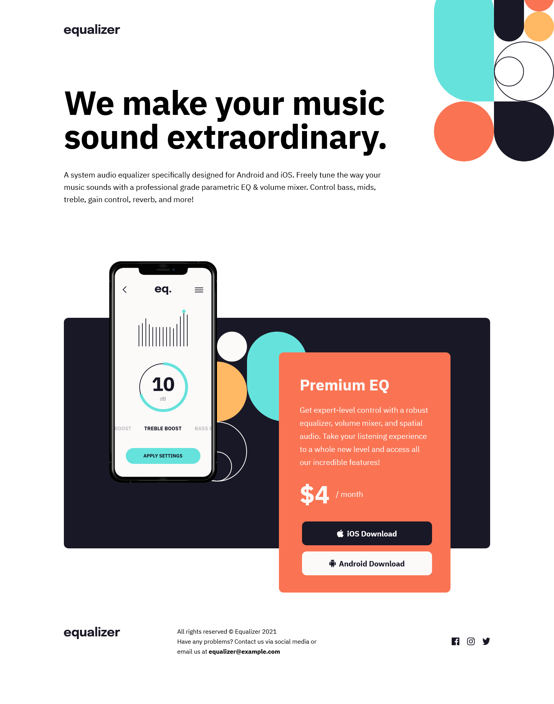
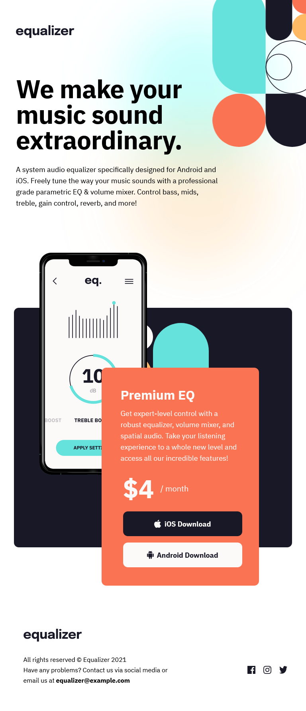
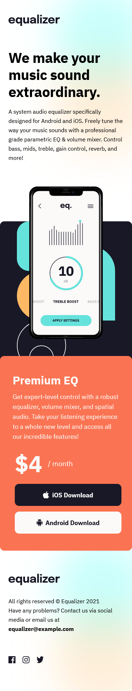

# Frontend Mentor - Equalizer landing page solution

This is a solution to the [Equalizer landing page challenge on Frontend Mentor](https://www.frontendmentor.io/challenges/equalizer-landing-page-7VJ4gp3DE). Frontend Mentor challenges help you improve your coding skills by building realistic projects.

## Table of contents

- [Overview](#overview)
  - [The challenge](#the-challenge)
  - [Screenshot](#screenshot)
  - [Links](#links)
- [My process](#my-process)
  - [Built with](#built-with)
  - [What I learned](#what-i-learned)
  - [Continued development](#continued-development)
- [Author](#author)

## Overview

### The challenge

Users should be able to:

- View the optimal layout depending on their device's screen size
- See hover states for interactive elements

### Screenshot

### Links

- Solution URL: [GitHub Project](https://github.com/joanFaseDev/frontendmentor/tree/master/equalizer-landing-page)
- Live Site URL: [Project hosted through Vercel](https://equalizer-landing-page-xi.vercel.app/)

## My process

### Built with

- Semantic HTML5 markup
- CSS custom properties
- Flexbox
- CSS Grid
- CUBE CSS

### What I learned

I did a ton of mistakes on that project which is good because now i can learn a lot! So, to resume, what i learned is:

- **Don't think pixel perfect**
  Having a figma file with all sizes, dimensions and spacing is great but i lost myself in numbers and ended up with a rigid design using way too much absolute values. It's better to be close to the design while conserving flexibility and responsiveness.

- **The importance of good naming convention**
  I thought i understood that concept, i really did but that project was way bigger than my previous ones and that added complexity makes me realize that my naming system is bad. I created way too many variables which ended up being used only once and the more i worked on that project the more i had trouble finding the values i was searching for.

- **Going mobile first is good but only if one remove as much complexity as possible**
  Mobile design has the advantage of having lesser available space comparing to tablet/desktop which means there's often no need to rely on complex layouts and lots of combinaison properties. By default, Html pages are responsive but i ended up breaking that responsiveness by adding way too much css stuff from the get-go. I could have made the mobile design way much simpler which could have helped me tremendously when doing tablet and desktop design.

### Continued development

I'm going to keep working on layout tools like flexbox and grid but also studying position and float properties. I really felt my lack of knowledge on this project but also my difficulty to set up elements where i want them and move them appropriately.

I'm also going to put extra effort into naming convention. Be it BEM, CUBE CSS or a mix up, i need to find a system i'm confortable with and which can carry me through a project from start to end.

## Author

- GitHub- [Frontend Mentor Projects](https://github.com/joanFaseDev/frontendmentor)
- Frontend Mentor - [@joanFaseDev](https://www.frontendmentor.io/profile/joanFaseDev)
