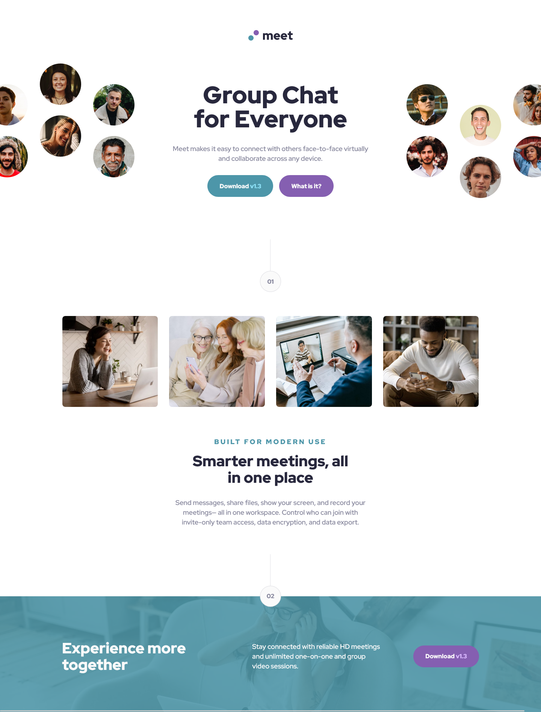
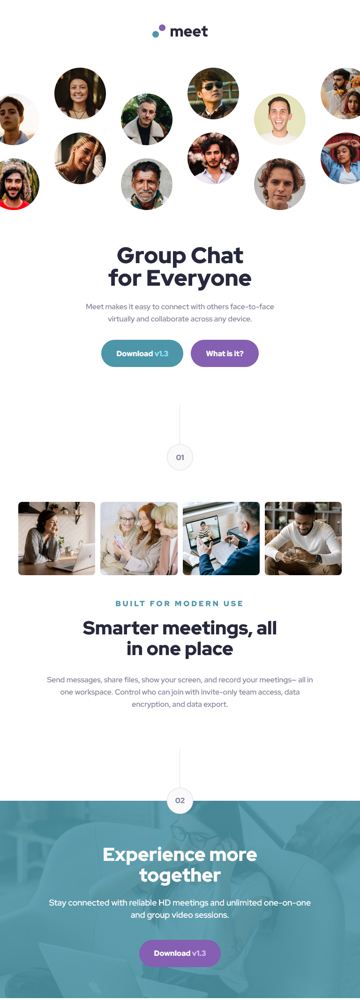

# Frontend Mentor - Meet landing page solution

This is a solution to the [Meet landing page challenge on Frontend Mentor](https://www.frontendmentor.io/challenges/meet-landing-page-rbTDS6OUR). Frontend Mentor challenges help you improve your coding skills by building realistic projects.

## Table of contents

- [Overview](#overview)
  - [The challenge](#the-challenge)
  - [Screenshot](#screenshot)
  - [Links](#links)
- [My process](#my-process)
  - [Built with](#built-with)
  - [What I learned](#what-i-learned)
  - [Continued development](#continued-development)
  - [Useful resources](#useful-resources)
- [Author](#author)
- [Acknowledgments](#acknowledgments)

## Overview

### The challenge

Users should be able to:

- View the optimal layout depending on their device's screen size
- See hover states for interactive elements

### Screenshot





### Links

- Solution URL: [Project GitHub](https://github.com/joanFaseDev/frontendmentor/tree/master/meet-landing-page)
- Live Site URL: [Project hosted through Vercel](https://meet-landing-page-pi.vercel.app/)

## My process

- **Group Chat for Everyone** part -> **header** element because it seems to be an introductory content. There's a logo, a quick description and two links: one to get the product, the second to learn more about it.

- **Ways to add an image passed a certain breakpoint?** -> Created two html elements _picture_ and made one of them invisible using _display: none_ until the specific breakpoint is passed.

- **No footer element** -> one of the assets of this project is an image named 'image-footer' yet i didn't use a _footer_ element for it wasn't appropriate for the type of content in it.

- **Breakpoint max(300px) added** -> added a breakpoint for very small device. Essentially to change the photo's layout.

### Built with

- Semantic HTML5 markup
- CSS custom properties
- Flexbox
- CSS Grid
- Mobile-first workflow
- [React](https://reactjs.org/) - JS library
- [Next.js](https://nextjs.org/) - React framework
- [Styled Components](https://styled-components.com/) - For styles

**Note: These are just examples. Delete this note and replace the list above with your own choices**

### What I learned

- First time i use :is selector!

```css
:is(.hero__button, .exp__button)[data-color="purple"] {
  background-color: var(--clr-purple-pale);
}

:is(.hero__button, .exp__button):is([data-color="green"], [data-color="purple"]) {
  cursor: pointer;
  transition: background-color 0.2s cubic-bezier(0, 0, 1, -0.18);
}

.hero__button[data-color="green"]:hover {
  background-color: var(--clr-green-pale-hover);
}

:is(.hero__button, .exp__button)[data-color="purple"]:hover {
  background-color: var(--clr-purple-pale-hover);
}
```

- Make a solid and simple mobile design without complex layouts makes all the follow up (tablet and desktop design) way more easier and natural.

### Continued development

Use this section to outline areas that you want to continue focusing on in future projects. These could be concepts you're still not completely comfortable with or techniques you found useful that you want to refine and perfect.

**Note: Delete this note and the content within this section and replace with your own plans for continued development.**

### Useful resources

- [Example resource 1](https://www.example.com) - This helped me for XYZ reason. I really liked this pattern and will use it going forward.
- [Example resource 2](https://www.example.com) - This is an amazing article which helped me finally understand XYZ. I'd recommend it to anyone still learning this concept.

**Note: Delete this note and replace the list above with resources that helped you during the challenge. These could come in handy for anyone viewing your solution or for yourself when you look back on this project in the future.**

## Author

- Website - [Add your name here](https://www.your-site.com)
- Frontend Mentor - [@yourusername](https://www.frontendmentor.io/profile/yourusername)
- Twitter - [@yourusername](https://www.twitter.com/yourusername)

**Note: Delete this note and add/remove/edit lines above based on what links you'd like to share.**

## Acknowledgments

This is where you can give a hat tip to anyone who helped you out on this project. Perhaps you worked in a team or got some inspiration from someone else's solution. This is the perfect place to give them some credit.

**Note: Delete this note and edit this section's content as necessary. If you completed this challenge by yourself, feel free to delete this section entirely.**
