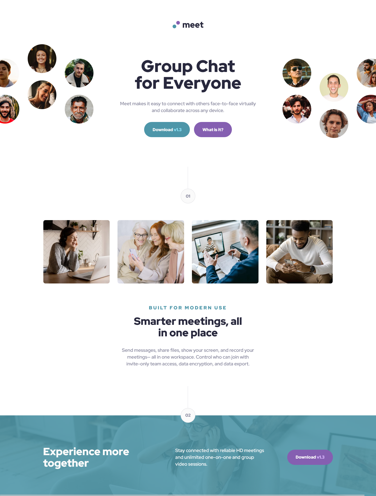
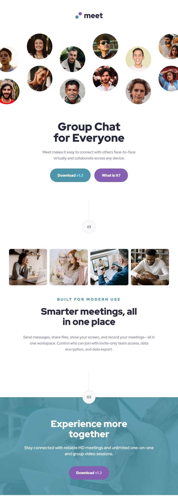

# Frontend Mentor - Meet landing page solution

This is a solution to the [Meet landing page challenge on Frontend Mentor](https://www.frontendmentor.io/challenges/meet-landing-page-rbTDS6OUR). Frontend Mentor challenges help you improve your coding skills by building realistic projects.

## Table of contents

- [Overview](#overview)
  - [The challenge](#the-challenge)
  - [Screenshot](#screenshot)
  - [Links](#links)
- [My process](#my-process)
  - [Built with](#built-with)
  - [What I learned](#what-i-learned)
  - [Continued development](#continued-development)
  - [Useful resources](#useful-resources)
- [Author](#author)
- [Acknowledgments](#acknowledgments)

## Overview

### The challenge

Users should be able to:

- View the optimal layout depending on their device's screen size
- See hover states for interactive elements

### Screenshot





### Links

- Solution URL: [Project GitHub](https://github.com/joanFaseDev/frontendmentor/tree/master/meet-landing-page)
- Live Site URL: [Project hosted through Vercel](https://meet-landing-page-pi.vercel.app/)

## My process

### Built with

- Semantic HTML5 markup
- CSS custom properties
- Flexbox
- CSS Grid
- Mobile-first workflow
- CUBE CSS

### What I learned

- The importance of **building a solid and simple mobile design without complex layouts**. It makes all the follow up (tablet and desktop design) way more easier and natural.

- The importance of **testing a project on multiple browsers**. I usually build my project through Firefox because i like its inspector mode but i had multiple alignment problems with my images, problems that showed on Internet Explorer and Chrome which i only noticed by chance at the end of the development.

- The importance to **go beyond what is asked when it feels like it is needed**. I added a breakpoint for very small devices because the layout for the main's section images didn't felt right below 300px. I'll try to do the same for the next projects.

- Also i used the _:is_ pseudo class for the first time and i really like it! Sure i used it poorly but i still won over a few lines of code as a result:

```css
:is(.hero__button, .exp__button)[data-color="purple"] {
  background-color: var(--clr-purple-pale);
}

:is(.hero__button, .exp__button):is([data-color="green"], [data-color="purple"]) {
  cursor: pointer;
  transition: background-color 0.2s cubic-bezier(0, 0, 1, -0.18);
}

.hero__button[data-color="green"]:hover {
  background-color: var(--clr-green-pale-hover);
}

:is(.hero__button, .exp__button)[data-color="purple"]:hover {
  background-color: var(--clr-purple-pale-hover);
}
```

### Continued development

- I'm gonna take some time to practice different ways of handling images. I always had difficulties with CSS properties like _object-fit_, _object-position_, _background-size_, ... which i find strange because it doesn't feel that difficult. Yet the fact is i had troubles even in this project so practice it is!

- I'm gonna keep using that mobile first workflow. I'm quite satisfied with the way i worked on that project. It felt way more natural than the previous one and i think the biggest reason is that i didn't overcomplicated the mobile design. Just kept it simple and solid.

## Author

- Frontend Mentor - [@joanFaseDev](https://www.frontendmentor.io/profile/joanFaseDev)
- Frontend Mentor Projects - [all my projects from frontendmentor.io](https://github.com/joanFaseDev/frontendmentor)
